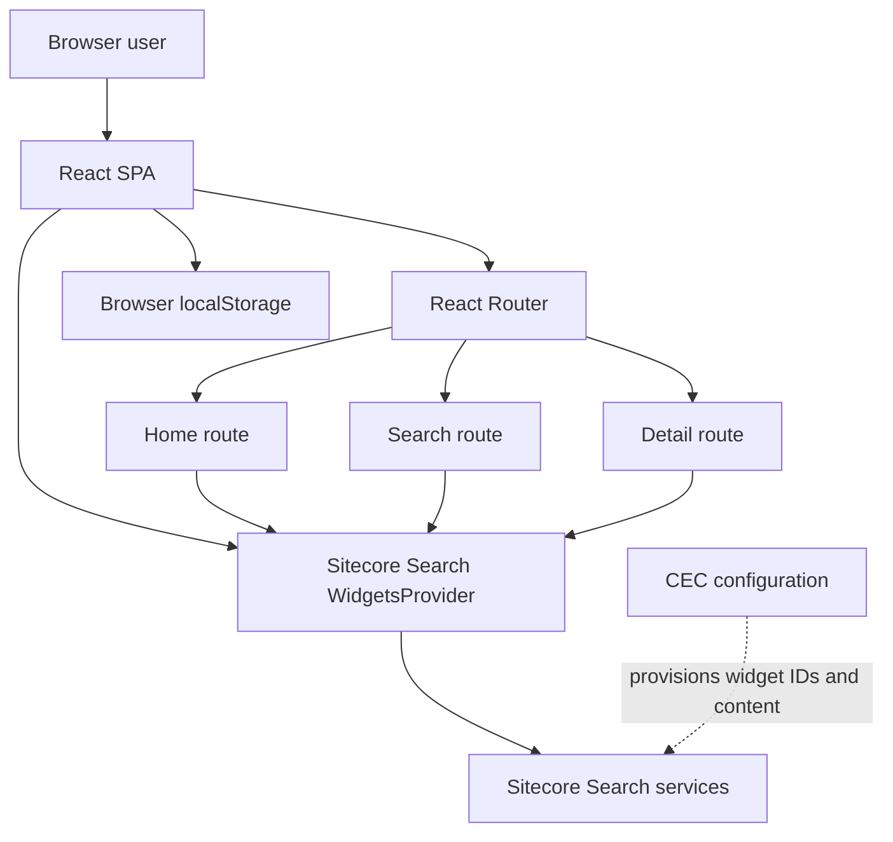

---
service: "sitecore.search-js-sdk-starter-kit"
owner: "team/search"
architect: "none"
jira: "none"
updated: 2026-04-30
lifecycle: "production"
type: Frontend
---

# Sitecore Search Starter Kit

## Service Metadata

**Service:** sitecore.search-js-sdk-starter-kit
**Product Owner:** team/search
**Architect:** none
**JIRA:** none
**Repository:** https://github.com/Sitecore/Sitecore-Search-JS-SDK-Starter-Kit
**Last Updated:** 2026-04-30
**Lifecycle:** Production
**Type:** Frontend

## Quick Reference

This repository is a Vite-powered React single-page application that demonstrates how to integrate Sitecore Search widgets, search flows, and event tracking into a content website.

Canonical repository: https://github.com/Sitecore/Sitecore-Search-JS-SDK-Starter-Kit

Authentication and connectivity:
- Browser-side configuration is injected through `VITE_SEARCH_ENV`, `VITE_SEARCH_CUSTOMER_KEY`, and `VITE_SEARCH_API_KEY`.
- The application mounts a `WidgetsProvider` and delegates search, preview search, questions, SEO, and tracking behavior to `@sitecore-search/react` and `@sitecore-search/ui`.
- There is no custom backend in this repository.

Primary user-facing routes:
- `/` - home page with HTML content blocks and highlighted search results
- `/search?q=<query>` - questions-and-answers plus faceted search results
- `/detail/:id` - article detail page built from a filtered search result lookup

Required CEC widget identifiers:
- `rfkid_6` - preview search in the header
- `rfkid_7` - search results for the search page and detail page lookup
- `rfkid_qa` - questions widget on the search page
- `home_hero` - home hero HTML block
- `highlight_title` - title block for highlighted content
- `search_home_highlight_articles` - highlighted search results on the home page
- `search_seo` in README, but the current app shell mounts `demo_search_seo` 

Data sensitivity summary:
- The app accepts end-user search terms in the browser and sends them to Sitecore Search through the SDK. 
- The app stores UI preferences for `lang` and `theme` in browser local storage.
- The repo owns no server-side database.

## Overview

Sitecore Search Starter Kit is a reference frontend implementation for teams adopting the Sitecore Search JavaScript SDK in a React application. It demonstrates how to:

- initialize the Sitecore Search widget runtime in a Vite application
- render multiple widget types in a single SPA
- keep SPA navigation in sync with Sitecore Search page context
- issue preview search, full search, and questions queries from the browser
- manually emit page-view tracking when client-side navigation would otherwise bypass SDK page tracking

The repository is not a general-purpose website framework and it is not a backend service. Its value is in showing the minimum application structure, routing, widget composition, and state wiring needed to build a Search-enabled frontend.

Primary consumers:
- frontend engineers integrating Sitecore Search into a React application
- solution architects validating expected widget composition and routing patterns
- Sitecore Search administrators preparing the required CEC configuration for demo or starter environments

High-level behavior:
- The app bootstraps a `WidgetsProvider` using browser-exposed environment variables.
- A global header exposes preview search, dark-mode toggling, and locale selection.
- Each page is wrapped by a higher-order component that updates `PageController` URI context and triggers page-view events on SPA navigation.
- Search and questions experiences are implemented with Sitecore Search hooks rather than custom fetch logic.
- Article detail content is derived by filtering the search index by content ID, which is acceptable for the demo but explicitly discouraged for production use.

## Architecture

### Runtime Topology



### System Interactions

| Direction | System | Interface | Purpose |
|---|---|---|---|
| Outbound | Sitecore Search services | `@sitecore-search/react` hooks and widgets over browser network requests | Fetch preview search suggestions, search results, questions, SEO metadata, and emit tracking events |
| Outbound | Browser local storage | `useStorage`, direct `localStorage` access | Persist selected language under `lang` and theme under `theme` |
| Inbound prerequisite | Customer Engagement Console (CEC) | Administrative configuration, not code-level integration in this repo | Supplies source content, widget definitions, suggestion blocks, and sort choices used by the starter kit |

### Owned State and Storage

| Store | Type | Owned By Repo | Purpose | Retention |
|---|---|---|---|---|
| Browser local storage `lang` | Client-side key/value | Yes | Persist the selected locale between sessions | Until user clears browser storage |
| Browser local storage `theme` | Client-side key/value | Yes | Persist dark/light mode preference | Until user clears browser storage |
| Search content index | Remote Sitecore Search data store | No | Supplies searchable content rendered by widgets | Managed outside this repo |
| Tracking events | Remote Sitecore Search telemetry | No | Capture page and entity view behavior |  |

### Configuration Dependencies

The app requires all of the following before it can operate correctly:

| Category | Requirement | Source |
|---|---|---|
| Runtime | Node.js LTS | README |
| Environment | `VITE_SEARCH_ENV` | README and `src/App.jsx` |
| Environment | `VITE_SEARCH_CUSTOMER_KEY` | README and `src/App.jsx` |
| Environment | `VITE_SEARCH_API_KEY` | README and `src/App.jsx` |
| Environment | `VITE_SEARCH_PATH` optional | README only |
| CEC content | indexed content sources | README |
| CEC suggestions | suggestion field `title_context_aware` | README and `src/widgets/PreviewSearch/index.jsx` |
| CEC sorting | `featured_desc` and `featured_asc` | README and `src/widgets/SearchResults/index.jsx` |

## Functional Requirements

### FR1. Initialize the Sitecore Search runtime in a browser SPA

The application must bootstrap Sitecore Search once at the app shell level and keep shared UI state available across routes.

Implementation details:
- `src/App.jsx` mounts `WidgetsProvider` with `env`, `customerKey`, and `apiKey` sourced from Vite environment variables.
- `publicSuffix={true}` is enabled when mounting the provider.
- `src/main.jsx` sets the Sitecore Search logger level to `debug` before rendering the app.
- The app shell always renders the global header, footer, and SEO widget around the routed page body.

Acceptance criteria:
- The app must fail fast in misconfigured environments where required Search environment variables are not supplied.
- The header must remain available on all routes.
- The footer must remain available on all routes.
- The SEO widget must be mounted globally for all routes.

### FR2. Support global preview search from the header

The header preview search is the primary entry point into the search experience.

Implementation details:
- `src/components/Header/index.jsx` renders `PreviewSearch` with widget ID `rfkid_6` and `defaultItemsPerPage={6}`.
- `src/widgets/PreviewSearch/index.jsx` calls `usePreviewSearch` with:

```js
{
    state: {
        suggestionsList: [{ suggestion: 'title_context_aware', max: 6 }],
        itemsPerPage: 6,
    },
}
```

- Typing into the input calls `onKeyphraseChange({ keyphrase: target.value })` on each change.
- Submitting the form navigates to `/search?q=<input value>` and clears the form field.
- When `title_context_aware` suggestions are present, they are rendered in a dedicated suggestion group titled `Suggestions`.
- Clicking a suggestion triggers `onSuggestionClick` and navigates to `/search?q=<suggestion text>`.
- Preview result cards render article image and title, trigger `onItemClick`, and navigate to `/detail/:id` when selected.

Acceptance criteria:
- The preview search input must be visible in the header on every route.
- The suggestion field name must remain `title_context_aware` unless CEC configuration and code are updated together.
- Preview search must show a loading spinner while the hook is loading or fetching.
- Preview search must navigate through React Router instead of performing a full page refresh.

### FR3. Render a Search-enabled home route

The home route demonstrates how static HTML blocks and search-driven content blocks coexist in the starter kit.

Current implementation:
- Route path: `/`
- Page event type: `home`
- Rendered widgets:
    - `HTMBlockWidget` with `rfkId="home_hero"`
    - `HTMBlockWidget` with `rfkId="highlight_title"`
    - `HomeHighlighted` with `rfkId="search_home_highlight_articles"`
- `HomeHighlighted` calls `useSearchResults` with a fixed query that:
    - applies `FilterEqual('type', 'Insights')`
    - sets keyphrase to `sitecore`
    - slices the first three returned articles for display

Documentation conflict:
- README describes an FAQ title block and questions widget on the home page, but the current code does not render them. 

Acceptance criteria:
- The home route must set SPA page context to the current URI and emit a `home` page view event.
- Highlighted content must be derived from search results, not hard-coded data.
- Only the first three highlighted results are rendered.

### FR4. Render a faceted search route driven by the `q` query string

The search route provides the primary result discovery experience.

Implementation details:
- Route path: `/search`
- Input contract: optional `q` query parameter, defaulting to an empty string when absent
- Page event type: `search`
- The page headline renders `Showing results for "<query>"`.
- `QuestionsAnswers` is mounted with:

```js
{
    rfkId: 'rfkid_qa',
    defaultKeyphrase: query,
    defaultRelatedQuestions: 4,
}
```

- `SearchResults` is mounted with `rfkId="rfkid_7"` and `defaultKeyphrase={query}`.
- `SearchResults` defaults to:

```js
{
    defaultSortType: 'featured_desc',
    defaultPage: 1,
    defaultItemsPerPage: 10,
}
```

- Results UI supports:
    - selected filter chips with individual removal and clear-all
    - accordion facets driven by API response
    - special price range facet rendering when a facet name equals `price`
    - sort order changes via `onSortChange`
    - page-size changes to `10`, `25`, or `50`
    - pagination via `onPageNumberChange`
    - a grid/list view toggle with `list` as the default
    - a blocking loading screen on initial load and an overlay spinner during refetches

Acceptance criteria:
- When no results are returned and no fetch is in progress, the page must render `0 Results`.
- Result counts must display the current visible range and total item count.
- Questions content must render only when the questions API returns either a primary answer or related questions.
- Search refinements must be driven by hook actions from `@sitecore-search/react`, not custom local filtering.

### FR5. Render a detail route backed by a Search lookup

The detail route provides a demo-only content detail page for a selected search item.

Implementation details:
- Route path: `/detail/:id`
- Page event type: `pdp`
- `src/pages/ArticleDetail.jsx` passes the route param `id` into `ArticleDetailWidget` with `rfkId="rfkid_7"`.
- `src/widgets/ArticleDetail/index.jsx` calls `useSearchResults` with:

```js
{
    query: (query) => {
        query.getRequest().setSearchFilter(new FilterEqual('id', id));
    },
    state: {
        itemsPerPage: 1,
    },
}
```

- The first returned item is treated as the primary article.
- The detail view renders `title`, `subtitle`, `description`, and `image_url` with a fallback image when `image_url` is absent.

Acceptance criteria:
- The route must update the Search page context to include the current pathname and query string.
- Detail pages must trigger `trackEntityPageViewEvent('content', { items: [{ id }] })` instead of the generic page event.
- The detail route must not assume a dedicated CMS content API exists in this repository.

## API Specification

This repository does not expose a custom HTTP API. Its external contracts are browser routes, Search widget configuration, and hook state passed to Sitecore Search SDK abstractions.

### Browser Route Contract

| Route | Inputs | Behavior | Output |
|---|---|---|---|
| `/` | None | Renders home hero, highlighted title, and highlighted content search widget | Starter landing page |
| `/search` | Optional query parameter `q` | Renders questions and search results driven by `q` | Search results page |
| `/detail/:id` | Path parameter `id` | Filters Search Results by content ID and renders the first matching item | Demo detail page |

### Environment Contract

| Variable | Required | Purpose |
|---|---|---|
| `VITE_SEARCH_ENV` | Yes | Selects the Sitecore Search environment |
| `VITE_SEARCH_CUSTOMER_KEY` | Yes | Supplies the customer key passed into `WidgetsProvider` |
| `VITE_SEARCH_API_KEY` | Yes | Supplies the API key passed into `WidgetsProvider` |
| `VITE_SEARCH_PATH` | Documented as optional | Mentioned in README for sites hosted under an extra path, but no usage was confirmed in inspected application code  |

### Widget Contract

| Widget ID | Widget Type | Mounted In Code | Purpose |
|---|---|---|---|
| `rfkid_6` | Preview Search | Yes | Header typeahead, suggestions, and quick result cards |
| `rfkid_7` | Search Results | Yes | Search page results and detail-page lookup |
| `rfkid_qa` | Questions | Yes | Questions and related questions on the search page |
| `home_hero` | HTML Block | Yes | Home hero content |
| `highlight_title` | HTML Block | Yes | Home highlighted content title |
| `faqs_title` | HTML Block | No in current code | Described in README only  |
| `search_home_highlight_articles` | Search Results | Yes | Home highlighted article strip |
| `search_seo` | SEO | README only | Described in README  |
| `demo_search_seo` | SEO | Yes | Mounted globally in the app shell  |

### Tracking Contract

| Event Path | Trigger | Event Type |
|---|---|---|
| All standard routes | `trackPageViewEvent(pageType)` | `page`, `home`, or `search` |
| Detail route | `trackEntityPageViewEvent('content', { items: [{ id }] })` | Entity page view |
| Widget interactions | SDK-managed and widget action callbacks | Sitecore Search tracking events |

## Data Model

The repository does not define a persistent server-side schema. It consumes Search response payloads and stores a small amount of client-side UI state.

### Client-Owned State

| Key | Type | Description |
|---|---|---|
| `lang` | string | Persisted locale code stored in local storage using `useStorage` |
| `theme` | string | Persisted UI theme stored in local storage as `light` or `dark` |
| `pageType` | string | Provided through `PageEventContext` to indicate `page`, `home`, `search`, or `pdp` |
| `dir` | string | Search result card layout mode, either `list` or `grid` |

### Locale Mapping

| Language Code | Country Code |
|---|---|
| `en` | `us` |
| `es` | `es` |
| `de` | `de` |
| `it` | `it` |
| `fr` | `fr` |
| `zh` | `cn` |
| `da` | `dk` |
| `ja` | `jp` |

### Search Result Item Shape Used By The UI

```js
{
    id: string,
    title?: string,
    name?: string,
    subtitle?: string,
    description?: string,
    type?: string,
    source_id?: string,
    image_url?: string,
    url?: string,
}
```

Field usage:
- Cards use `id`, `name || title`, `type`, `source_id`, `image_url`, and `url`.
- Preview cards use `id`, `title`, `image_url`, `source_id`, and `url`.
- The detail page uses `title`, `subtitle`, `description`, and `image_url`.

### Search Results Payload Shape Used By The UI

```js
{
    total_item: number,
    sort: {
        choices: Array<{ name: string, label: string }>,
    },
    facet: Array<{
        name: string,
        label: string,
        value: Array<any>,
    }>,
    content: Array<SearchResultItem>,
}
```

Facet handling rules:
- Non-`price` facets are rendered as checkbox lists with facet value IDs, labels, and optional counts.
- The `price` facet is treated specially and converted into a min/max range slider.

### Questions Payload Shape Used By The UI

```js
{
    answer: {
        question?: string,
        answer?: string,
    },
    related_questions: Array<{
        question: string,
        answer: string,
    }>,
}
```

### Selected Filter Shape Used By The UI

```js
{
    facetId: string,
    facetLabel: string,
    valueLabel?: string,
    min?: number,
    max?: number,
}
```

## Business Rules

### SPA Page Tracking

- The app does not rely solely on the SDK's automatic initial page tracking.
- On every route change, `useUri()` returns `pathname + search`, and `withPageTracking` passes that into `PageController.getContext().setPageUri(uri)`.
- If the route is a PDP and has an `id`, the app records an entity page view for `content`; otherwise it records a normal page view using the page type constant.

### Language Synchronization

- Language defaults to `en` when no prior selection exists.
- Updating language writes the value to local storage and updates both `setLocaleLanguage(language)` and `setLocaleCountry(locales[language].country)` on the Search page context.

### Theme Persistence

- Theme defaults to light unless local storage contains `theme=dark`.
- Toggling dark mode updates the `dark` class on `document.documentElement` and persists the new theme value.

### Search Submission And Navigation

- Header search submission always navigates to `/search?q=<submitted value>`.
- Preview-search suggestion clicks and preview result clicks both navigate through React Router.
- After submit, the preview search input is cleared.

### Search Results Presentation

- Search result layout defaults to `list` and can be toggled to `grid`.
- Query summary text is computed from the current page, page size, total items, and returned items.
- Initial load uses a full-page spinner; background refetches use an overlay spinner to preserve page layout.

### Questions Rendering

- The questions card is rendered only when either a main answer exists or at least one related question exists.
- Related questions are rendered as an accordion labeled `People also ask ...`.

### Facet And Filter Behavior

- Selected filters are displayed as removable chips.
- Removing a selected chip invokes `onRemoveFilter(selectedFacet)`.
- Clearing all selected filters invokes `onClearFilters()`.
- Range labels are formatted as `< $max`, `> $min`, or `$min - $max` depending on which bounds are present.

### Home Highlighting Logic

- Highlighted home content is not editorially hard-coded in the repo.
- The widget query always applies `type = Insights` and keyphrase `sitecore`.
- Only the first three returned items are rendered on the home page.

## Compliance & Audit

### Data Classification

- End-user search terms are captured from the preview search box and the search results route query string. 
- The app renders content fields returned by Sitecore Search, including article identifiers, titles, subtitles, descriptions, images, URLs, types, and source identifiers.
- The repository itself does not classify these values as public, internal, confidential, or regulated. 

### Access Controls

- Access to Sitecore Search is configured through `VITE_SEARCH_CUSTOMER_KEY` and `VITE_SEARCH_API_KEY` passed into `WidgetsProvider`.
- Because Vite exposes these values to browser code, only keys intended for browser usage should be configured. 
- Administrative setup in CEC is required to provision widgets, suggestions, sort choices, and source indexing.

### Audit Logging and Retention

- The app manually triggers `trackPageViewEvent` for standard routes and `trackEntityPageViewEvent` for detail pages.
- The SDK also emits widget-related events inferred by widget rendering and interaction, as described in the README.
- Repository sources do not document retention, auditing, or export policies for these events. 

## Operations

### Local Development

| Task | Command | Notes |
|---|---|---|
| Install dependencies | `npm install` | Required before running or linting |
| Start dev server | `npm run dev` | Serves the SPA locally, default Vite port in README is `5173` |
| Build production bundle | `npm run build` | Runs Vite production build |
| Preview production bundle | `npm run preview` | Serves the built artifacts locally |
| Lint source | `npm run lint` | ESLint configured for `.js` and `.jsx` |

### Monitoring and Troubleshooting

- `src/main.jsx` sets the Sitecore Search logger level to `debug`, which is useful for local troubleshooting.
- The README recommends validating SDK event flow through the CEC monitoring view.
- Runtime failures are most likely to come from missing environment variables, missing widget IDs, or incomplete CEC configuration.

### Deployment Shape

- This repo builds a static frontend bundle with Vite.
- No deployment manifests or infrastructure-as-code definitions are present in the repository.
- Hosting platform, CDN behavior, and rollback process are not documented in repository sources.

## Non-Functional Requirements

- The application must run as a client-side React SPA on modern browsers supported by Vite and React 19.
- The application assumes Sitecore Search network availability for all primary user journeys.
- Search result pages should remain interactive during refetches by overlaying a spinner instead of remounting the entire page.
- Preview search should respond incrementally to input changes by updating keyphrase state on each change event.
- The implementation must support locale switching and dark-mode preference persistence without requiring a full page reload.

## Known Issues & Limitations

- The article detail page is implemented by filtering the Search Results widget by content ID. The README explicitly warns that this is a demo-only pattern and should not be used as the production source of truth for full content rendering.
- The repository depends on out-of-band CEC configuration; without indexed content, widget IDs, suggestion blocks, and sorting options, the UI will render incompletely or fail to return expected data.
- SEO widget configuration appears inconsistent between the README (`search_seo`) and the current app shell (`demo_search_seo`). 
- There is no backend-owned validation layer, audit policy, or secret-rotation mechanism in this repository.

## Additional Context

- Canonical source repository: https://github.com/Sitecore/Sitecore-Search-JS-SDK-Starter-Kit
- The repository name and README position this project as a starter kit and demo website rather than a production business application.
- The package manifest uses `@sitecore-search/react` and `@sitecore-search/ui` version `3.0.0`, together with Vite 5, React 19, React Router 6, Tailwind CSS, and Radix UI primitives.
- The repo includes `@sitecore-search/cli` as a development dependency to scaffold additional widgets, but the README documents `npm run create-widget` while `package.json` currently exposes only `dev`, `build`, `lint`, and `preview`. 
